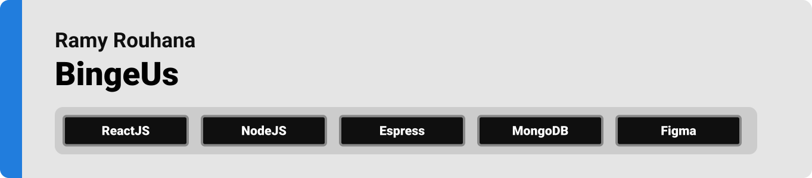
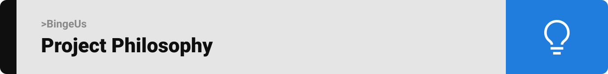
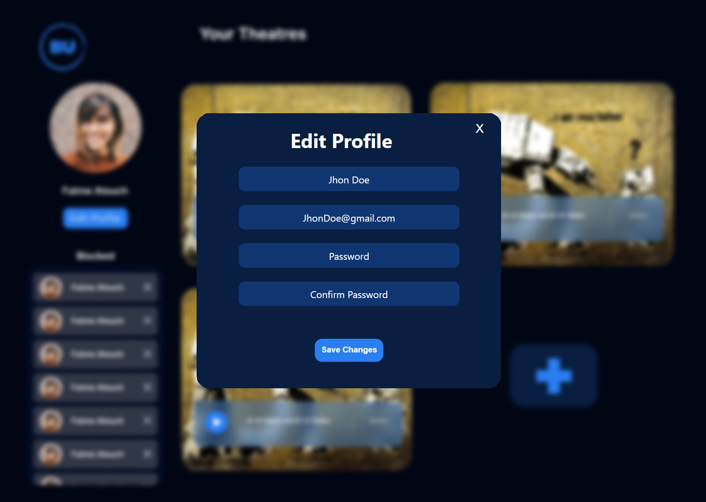

<div align="center">

> BingeUs, is a website where the user can can host or join video streams with friends or random people online. 


> **[PROJECT PHILOSOPHY](https://github.com/rami3rouhana/bingeus#project-philosophy) • [WIREFRAMES](https://github.com/rami3rouhana/bingeus#wireframes) • [TECH STACK](https://github.com/rami3rouhana/bingeus#tech-stack) • [IMPLEMENTATION](https://github.com/rami3rouhana/bingeus#implementation) • [HOW TO RUN?](https://github.com/rami3rouhana/bingeus#how-to-run)**

</div>

<br><br>




> BeingeUs is a website where the users can have others watch movies with them. 
> 
> with the scalability of a backend implemented with microservices architecture, the users will not have any worries even in peak usage hours.
> 
> There is no need to upload any images or desciption for your theater. With the use of IMDB they are automatically displayed for your movie from its name
>
> A lockable chat room with a ban system is available for use.

### User Stories
- As a user, I want to have a quick and easy way to find a movie to watch with others.
- As a user, I want to be able to easily create a place where I can store and replay my movie lists.
- As a user, I want to have a place to chat with others about a certain movie whle watching.
- As a user, I want to easily find the most trending movies being watched out there.
- As a user, I want to be able to sync my movie with my online friends.

### Admin Stories
- As an admin, I want to be able to easily have a switchable playlist for my theater
- As an admin, I must be able ban and unban viewers interactions at will.

<br><br>


> This design was planned before on paper, then moved to Figma app for the fine details.
Note that i didn't use any styling library or theme, all from scratch and using pure css modules

| Login | Signup |
| ------| -------|
|  |  |


| Landing | Theater Dispaly |
| --------| ----------------|
|  |  |


| Profile | Edit Porfile | Add Theater |
| --------| -------------| ------------|
|  |  |  |


| Theater | Theater Chat | Theater Users | Theater Playlist |
| --------| -------------| --------------| -----------------|
|  |  |  |  |


<br><br>


Here's a brief high-level overview of the tech stack BingeUs uses:

- The [Node.js runtime environment](https://nodejs.org/en/about/) that runs on the V8 engine is used to run the backend environment.
- The database used is [MongoDB](https://www.mongodb.com/). This NoSQL database program saves data in a JSON format and is very fast, scalable, and flexible.
- [Express.js](https://expressjs.com/) is a back-end web application framework for Node.js. It's a layer built on the top of the Node.js that helps manage servers and routes
- [React.js](https://fonts.google.com/specimen/Work+Sans)is the front-end JavaScript library used for building user interfaces based on UI components.
- [Docker](https://www.docker.com/) is a set of platform as a service products that use OS-level virtualization to deliver software in packages called containers. 
- [RabbitMQ](https://www.rabbitmq.com/) is an open-source message-broker software that originally implemented the Advanced Message Queuing Protocol.
- [Socket.io](https://socket.io/) is an event-driven library for real-time web applications. It enables real-time, bi-directional communication between web clients and servers.


<br><br>


> Using the above mentioned tech stacks and the wireframes built with figma, the implementation of the app is shown as below, these are screenshots from the real app

| Signup | Profile With Blocked User |
| -------| -------|
|  |  |


| Login | Edit Profile |
| ------| -------------|
|  |  |


|  Upload Theater | Joining Theater | Theater Creation |
| ----------------| ----------------| -----------------|
|   |  |  


| Chatting | Block |
| ---------| ------|
|  |  |


| Theater Users | Theater Playlist |
| --------------| -----------------|
|  |  |


<br><br>


> To get a local copy up and running follow these simple example steps.

### Prerequisites

* npm
  ```sh
  npm install npm@latest -g
  ```
* docker
   ```sh
   install docker https://docs.docker.com/desktop/install/windows-install/
   ```

### Installation

1. Clone the repo.
   ```sh
   git clone https://github.com/rami3rouhana/bingeus.git
   ```

2. Create an api key from `https://www.omdbapi.com/`, verify it and extract the api key from the url.

3. Create your .env file in your "/frontend" section and add: 
   ```js
      REACT_APP_API_BASE_URL= *backend server url*

      REACT_APP_API_OMDB_API_KEY =*api key extracted from the step above*

   ```
4. Install NPM packages on the frontend.
   ```sh
   npm install
   ```

5. Create your .env file in your "/backend" section and add: 
    ```js
    THEATER_PORT= *custom port number* 

    POLL_PORT= *custom port number* 

    SOCKET_PORT= *custom port number*

    USER_PORT= *custom port number*

    MONGO_URI= *your mongo connection string here from Atlas*

    APP_SECRET= *JWT encryption key here*

    MSG_QUEUE_URL= *your rabbitmq connection string here from 'https://customer.cloudamqp.com/login'*

    ```

6. Run docker image.
   ```sh
   docker compose up
   ```

